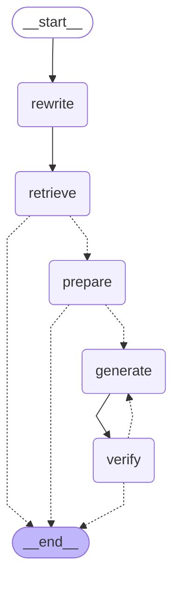

# `/ask` pipeline (LangGraph)

Generated by `make graph` (`python -m lexrh.rag.pipeline`). Dotted edges are conditional.

```mermaid
---
config:
  flowchart:
    curve: linear
---
graph TD;
	__start__([<p>__start__</p>]):::first
	rewrite(rewrite)
	retrieve(retrieve)
	prepare(prepare)
	generate(generate)
	verify(verify)
	__end__([<p>__end__</p>]):::last
	__start__ --> rewrite;
	generate --> verify;
	prepare -.-> __end__;
	prepare -.-> generate;
	retrieve -.-> __end__;
	retrieve -.-> prepare;
	rewrite --> retrieve;
	verify -.-> __end__;
	verify -.-> generate;
	classDef default fill:#f2f0ff,line-height:1.2
	classDef first fill-opacity:0
	classDef last fill:#bfb6fc

```
